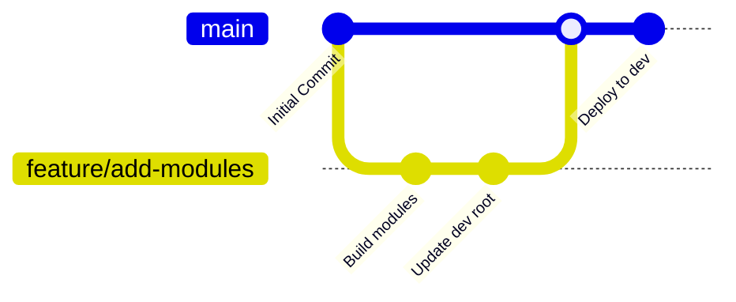

# Azure Front Door Terraform Lab

An enterprise-grade, modular Terraform project to provision and manage a highly available Azure Front Door setup routing traffic to Azure Web Apps, complete with monitoring and resource isolation.

## Directory Structure

```text
azure-frontdoor-terraform-lab/
│
├── environments/
│   └── dev/                  # Development environment configuration
│       ├── main.tf           # Dev root configuration
│       ├── providers.tf      # Provider versions and definitions
│       ├── variables.tf      # Dev environment input variables
│       ├── terraform.tfvars  # Dev environment variables values
│       └── outputs.tf        # Dev environment outputs
│
├── modules/
│   ├── resource-group/       # Resource Group module
│   ├── web-app/              # Azure App Service Plan & Web App module
│   ├── frontdoor/            # Azure Front Door (CDN) profile, endpoint, & routing
│   └── monitoring/           # Log Analytics Workspace, App Insights, & alerts
│
├── .gitignore                # Excludes Terraform state and local caches
├── README.md                 # Project documentation
└── LICENSE                   # MIT License
```

---

## Git Branching & Workflow Strategy

To ensure code stability, track infrastructure changes, and allow safe collaborative changes, we adopt a **GitHub Flow** strategy combined with directory-isolated environments.

### 1. Main Branch (`main`)
* Represents the source of truth for the active infrastructure state.
* The code on `main` is expected to be stable, linted, formatted, and validated.
* Direct commits to `main` are restricted.

### 2. Feature Branches (`feature/*` or `fix/*`)
* Used for any additions, enhancements, or bug fixes (e.g., `feature/web-app-module` or `fix/frontdoor-routing`).
* Created from `main` and merged back via Pull Requests (PRs).

### 3. Proposed Branching Workflow



1. **Local Development**:
   * Create a branch: `git checkout -b feature/<feature-name>`
   * Make changes, format with `terraform fmt`, and validate with `terraform validate`.
2. **Pull Request & CI**:
   * Push branch to GitHub: `git push -u origin feature/<feature-name>`
   * Open a Pull Request targeting `main`.
   * CI/CD pipelines run `terraform plan` to show the expected changes without applying them.
3. **Merge & CD**:
   * Once approved and merged into `main`, the CD pipeline runs `terraform apply` on the targeted environment directory (e.g., `environments/dev`).

---

## Getting Started

### Prerequisites
* [Terraform](https://developer.hashicorp.com/terraform/downloads) (>= 1.3.0)
* [Azure CLI](https://learn.microsoft.com/en-us/cli/azure/install-azure-cli)
* Azure Subscription credentials

### Deployment Steps
1. Log in to Azure via the CLI:
   ```bash
   az login
   ```
2. Navigate to the development environment:
   ```bash
   cd environments/dev
   ```
3. Initialize the backend and providers:
   ```bash
   terraform init
   ```
4. Verify the plan:
   ```bash
   terraform plan
   ```
5. Apply the configuration:
   ```bash
   terraform apply
   ```
