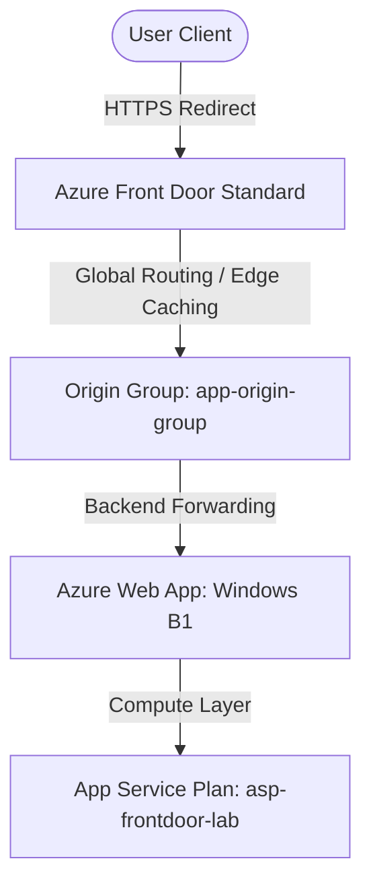

# Azure Front Door + Azure App Service Terraform Lab

An enterprise-grade, modular Terraform project designed to provision and manage a globally distributed, highly available Azure Front Door Standard CDN profile routing traffic to a Windows-based Azure App Service (Web App).

---

## Architecture Diagram



---

## Directory Structure

```text
azure-frontdoor-terraform-lab/
│
├── environments/
│   └── dev/                  # Development environment configuration
│       ├── main.tf           # Dev root configuration (Instantiates modules)
│       ├── providers.tf      # Provider versions and definitions (AzureRM ~> 4.0)
│       ├── variables.tf      # Dev environment input variables
│       ├── terraform.tfvars  # Dev environment variables values
│       └── outputs.tf        # Dev environment outputs (Web App URL, Endpoint)
│
├── modules/
│   ├── resource-group/       # Resource Group module
│   ├── web-app/              # Azure App Service Plan (B1 Windows) & Web App
│   ├── frontdoor/            # Azure Front Door CDN profile, endpoint, cache settings, & route
│   └── monitoring/           # Log Analytics Workspace, App Insights, & alerts
│
├── .gitignore                # Excludes Terraform state and local caches
├── README.md                 # Project documentation
└── LICENSE                   # MIT License
```

---

## Getting Started

### Prerequisites
* **Terraform** (>= 1.5.0)
* **Azure CLI** (>= 2.50.0)
* Azure subscription with Owner/Contributor access.

### Deployment Steps
1. **Login to Azure**:
   ```bash
   az login
   ```
2. **Navigate to the dev environment**:
   ```bash
   cd environments/dev
   ```
3. **Initialize the Terraform backend and modules**:
   ```bash
   terraform init
   ```
4. **Format and Validate configuration**:
   ```bash
   terraform fmt -recursive
   terraform validate
   ```
5. **Generate and review the deployment plan**:
   ```bash
   terraform plan
   ```
6. **Apply configuration**:
   ```bash
   terraform apply -auto-approve
   ```

*Note: If you run into Azure API propagation delays or subscription-level limitations, you can use the `-refresh=false` flag to apply new configurations without querying existing resources:*
```bash
terraform apply -refresh=false -auto-approve
```

---

## Important Subscription & API Workarounds

### 1. Free Trial & Student Account Policy Restriction
If you attempt to deploy Azure Front Door resources under a Free Trial or Student subscription, Azure will reject the creation with the following message:
```text
BadRequest: Free Trial and Student account is forbidden for Azure Frontdoor resources.
```
To run this in production, you must use a **Pay-As-You-Go** or **Enterprise/Sponsored** subscription.

### 2. App Service API read bugs on F1 SKU
The Free (F1) App Service plan does not support sub-resource configuration endpoints (such as `/config/azurestorageaccounts` or `/config/publishingCredentials`). As a result, the `azurerm` provider v4.x throws a `404 Not Found` during state refresh. 
* **Workaround**: We configured a **Basic B1** Windows App Service Plan which fully supports these endpoints, bypassing the 404 read bugs completely.

---

## Validation & Testing

### 1. HTTPS Redirection
Confirm HTTP traffic automatically redirects to HTTPS:
```bash
curl -I http://<frontdoor-endpoint>.azurefd.net
```
Expected response:
```http
HTTP/1.1 307 Temporary Redirect
Location: https://<frontdoor-endpoint>.azurefd.net/
```

### 2. CDN Caching Validation
Verify edge caching behavior by opening your browser's Developer Tools (F12) -> **Network Tab**, reloading the page, and inspecting the response headers:
* Look for the `x-cache` header:
  * `TCP_MISS` - Content served from backend (first load).
  * `TCP_HIT` - Content served directly from Azure Edge location (subsequent loads).

### 3. Compression Validation
Verify static assets are compressed at the edge:
* Look for the `content-encoding` header in the response:
  * `gzip` or `br` (Brotli)
